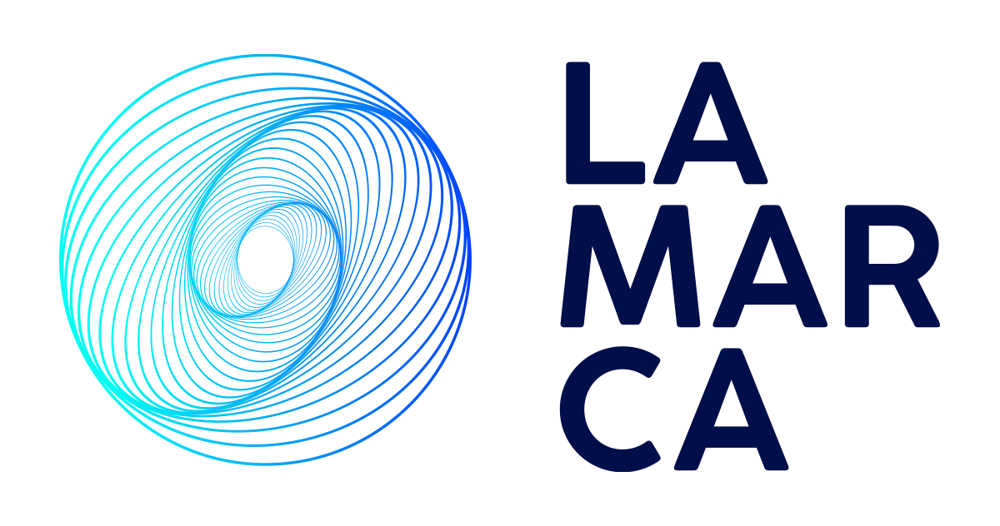
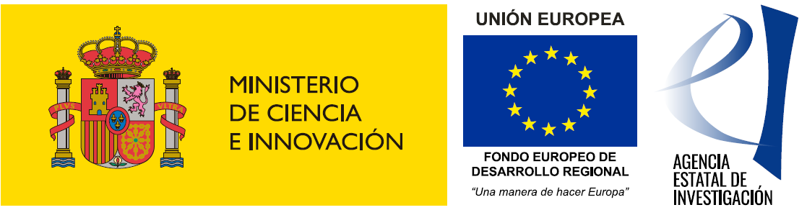

# LAMARCA tool

Welcome!

This is the software platform for the transference of the results of the [LAMARCA project](https://www.lamarca-project.eu/).

**LAMARCA tool** contains customized data products and methods designed for the integrated management of coastal areas, focusing on the dispersion and accumulation of marine litter. **LAMARCA tool** is composed by the following solutions:

-Real time metocean observations and forecasts

-Gap filling tools for HF radar data (**BRANCH Gap_filling_tools**)

-Lagrangian products LCS, LFN

-Marine litter data, paths and hotspots

