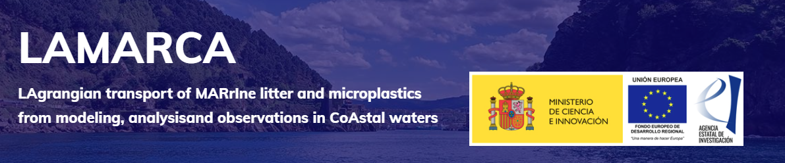

     
     
   

    
# LAMARCA tool
Welcome!

This is the software platform for the transference of the results of the [LAMARCA project](https://www.lamarca-project.eu/).

**LAMARCA tool** contains customized data products and methods designed for the integrated management of coastal areas, focusing on the dispersion and accumulation of marine litter. 

**LAMARCA tool** is composed by the following solutions:

-  `Real time metocean observations and forecasts` 

- `Gap filling tools for HF radar data`
  
- `Lagrangian models `

- `Lagrangian analysis tools for Lagrangian coherent structures (LCS) and Lagrangian divergence `

- `Marine litter data, paths and hotspots`

<!-- TABLE OF CONTENTS -->

  
Table of Contents

  <ol>
    <li>
      <a href="#about-the-project">About The Project</a>
         </li>
    <li>
      <a href="#text2">Getting Started</a>
      <ul>
        <li><a href="#text3">Prerequisites</a></li>
        <li><a href="#text4">Installation</a></li>
      </ul>
    </li>
    <li><a href="#usage">Usage</a></li>
    <li><a href="#roadmap">Roadmap</a></li>
    <li><a href="#contributing">Contributing</a></li>
    <li><a href="#license">License</a></li>
    <li><a href="#contact">Contact</a></li>
    <li><a href="#acknowledgments">Acknowledgments</a></li>
  </ol>

> [!TIP]
> These solutions are available in [AZTI's github repository](https://github.com/Fundacion-AZTI/LAMARCA) and the Getting Started Guide is readily available [here](https://fundacion-azti.github.io/gam-niche/).

<!-- ABOUT THE PROJECT -->
## About The Project

The aim of this project is to further understand the role of oceanic transport in marine litter (microplastics and meso/macrolitter) dispersion and accumulation areas in the sea surface, along the water column and over the seafloor. With special emphasis on coastal zones and in the range of scales from 1 m to 10 km, where the vertical motions by marine currents play a relevant role. Focusing on the distribution of marine litter by ocean currents, we propose an approach that combines ocean-current structures, oceanographic campaigns, and new Lagrangian tools from complex systems to characterize marine connectivity and mixing properties in coastal waters.

 

**LAMARCA** is made up of 3 separe projects:
**LAMARCA-MODS** _Modeling, scale dependence and descriptors of frontal flows_, **LAMARCA-SC** _Structures of transport and connectivity patterns_ and **LAMARCA-OMO** 
_Observation and monitoring in the Bay of Biscay and Balearic sea coastal areas_. **LAMARCA** is focused on two different study areas in the Bay of Biscay (BoB) and the
Western Mediterranean Sea (WMS), which are two regions extremely affected by the accumulation of marine litter.

<!-- SOLUTION1 -->
## Real time metocean observations and forecasts
### Installation
🔵 Solution in progress

(<a href="#readme-top">back to top</a>)

<!-- SOLUTION2 -->
## Gap filling tools for HF radar data
### Installation
🔵 Solution in progress

(<a href="#readme-top">back to top</a>)

<!-- SOLUTION3 -->
## Lagrangian analysis tools for Lagrangian coherent structures (LCS) and Lagrangian divergence
### Installation
🔵 Solution in progress

(<a href="#readme-top">back to top</a>)

<!-- SOLUTION4 -->
## Marine litter data, paths and hotspots
🔵 Solution in progress

(<a href="#readme-top">back to top</a>)

## Scientific publications
- Ehstand, N., Donner, R. V., López, C., and Hernández-García, E. (2023). Network percolation provides early warnings of abrupt changes in coupled oscillatory systems: An explanatory analysis. Phys. Rev. E 108, 054207. doi: 10.1103/PhysRevE.108.054207
	- Link to the paper: https://journals.aps.org/pre/abstract/10.1103/PhysRevE.108.054207
 - van de Vijsel, R. C., Hernández-García, E., Orfila, A., and Gomila, D. (2023). Optimal wave reflection as a mechanism for seagrass self-organization. Sci Rep 13, 20278. doi: 10.1038/s41598-023-46788-4
  	- Link to the paper: https://www.nature.com/articles/s41598-023-46788-4
 - Manso-Narvarte, I., Caballero, A., Hernández-Carrasco, I., Orfila, A., Santos Mocoroa, M., Cotano, U., et al. (2024). Effect of circulation at early life stages of European anchovy in the Bay of Biscay from observational data and a Lagrangian approach. Journal of Marine Systems 242, 103938. doi: 10.1016/j.jmarsys.2023.103938
	- Link to the paper: https://www.sciencedirect.com/science/article/pii/S0924796323000829

(<a href="#readme-top">back to top</a>)

<!-- CONTRIBUTING -->
## Contributing

(<a href="#readme-top">back to top</a>)

<!-- LICENSE -->
## License

This work is licensed under a Creative Commons Attribution-NonCommercial-ShareAlike 4.0 International License (CC BY-NC-SA 4.0)

(<a href="#readme-top">back to top</a>)

<!-- CONTACT -->
## Contact
Anna Rubio - arubio@azti.es
Irene Ruiz - iruiz@azti.es

Project Link: [LAMARCA project](https://www.lamarca-project.eu/).

(<a href="#readme-top">back to top</a>)

<!-- ACKNOWLEDGMENTS -->
## Acknowledgments

The developing of this software platform has been supported by Grant Project PID2021-123352OB-C31, SP2: PID2021-123352OB-C32 and SP3: PID2021-123352OB-C33 funded by MCIN/AEI/ 10.13039/501100011033 and by “ERDF A way of making Europe”

(<a href="#readme-top">back to top</a>)

