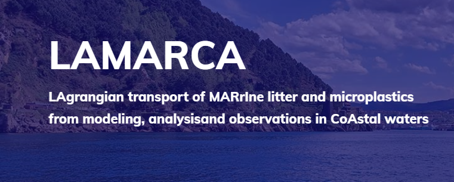

     
     
   

    
# LAMARCA tool
Welcome!

This is the software platform for the transference of the results of the [LAMARCA project](https://www.lamarca-project.eu/).

**LAMARCA tool** contains customized data products and methods designed for the integrated management of coastal areas, focusing on the dispersion and accumulation of marine litter. **LAMARCA tool** is composed by the following solutions:

- [x] Real time metocean observations and forecasts

- [x] Gap filling tools for HF radar data 

- [x] Lagrangian products LCS, LFN

- [x] Marine litter data, paths and hotspots

<!-- TABLE OF CONTENTS -->

  
Table of Contents

  <ol>
    <li>
      <a href="#about-the-project">About The Project</a>
         </li>
    <li>
      <a href="#text2">Getting Started</a>
      <ul>
        <li><a href="#text3">Prerequisites</a></li>
        <li><a href="#text4">Installation</a></li>
      </ul>
    </li>
    <li><a href="#usage">Usage</a></li>
    <li><a href="#roadmap">Roadmap</a></li>
    <li><a href="#contributing">Contributing</a></li>
    <li><a href="#license">License</a></li>
    <li><a href="#contact">Contact</a></li>
    <li><a href="#acknowledgments">Acknowledgments</a></li>
  </ol>

> [!TIP]
> These solutions are available in [AZTI's github repository](https://github.com/Fundacion-AZTI/LAMARCA) and the Getting Started Guide is readily available [here](https://fundacion-azti.github.io/gam-niche/).

<!-- ABOUT THE PROJECT -->
## About The Project

The aim of this project is to further understand the role of oceanic transport in marine litter (microplastics and meso/macrolitter) dispersion and accumulation areas in the sea surface, along the water column and over the seafloor. With special emphasis on coastal zones and in the range of scales from 1 m to 10 km, where the vertical motions by marine currents play a relevant role. Focusing on the distribution of marine litter by ocean currents, we propose an approach that combines ocean-current structures, oceanographic campaigns, and new Lagrangian tools from complex systems to characterize marine connectivity and mixing properties in coastal waters.

 

<!-- GETTING STARTED -->
## Getting Started

### Prerequisites

### Installation

<!-- USAGE EXAMPLES -->
## Usage

<!-- ROADMAP -->
## Roadmap

<!-- CONTRIBUTING -->
## Contributing

<!-- LICENSE -->
## License

This work is licensed under a Creative Commons Attribution-NonCommercial-ShareAlike 4.0 International License (CC BY-NC-SA 4.0)

<!-- CONTACT -->
## Contact
Anna Rubio - arubio@azti.es
Irene Ruiz - iruiz@azti.es

Project Link: [LAMARCA project](https://www.lamarca-project.eu/).

(<a href="#readme-top">back to top</a>)

<!-- ACKNOWLEDGMENTS -->
## Acknowledgments

The developing of this software platform has been supported by Grant Project PID2021-123352OB-C31, SP2: PID2021-123352OB-C32 and SP3: PID2021-123352OB-C33 funded by MCIN/AEI/ 10.13039/501100011033 and by “ERDF A way of making Europe”
